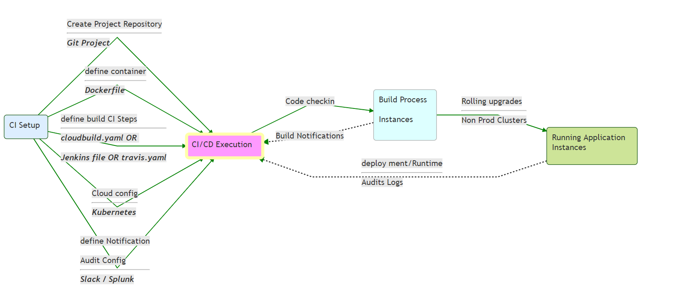

## Kafka Projects  CI / CD 

This project aims to define the various elements of Continuous delivery process and also provide guidelines for setup and execution of CI/CD process.


### 1. CI Overview



> __A CI setup__

CI aims to provide a framework for facilitating software application rollout in a responsive and responsible manner. Pillars of a CI system are.

* Code repository with version control
* Version controlled applicaiton code and build automation scripts.
* Well defined and preferably scripted steps for standing up application deployment environments.
* Automated building of source code to `immutable` deployment images.
* Automated and Manual test cases with clearly defined acceptence criteria.
* Automated Build Promotion from one environment to another 
* CI event notification system which generates  `actionable` events.
* Auditing system for CI events.


### 2. CI / CD Execution


> __CI in action__


### 3. Project Setup Guide


Follow the steps below to bootstrap a Spring Boot microservices project for automated build using Google Cloud Build and automated deployment to Google Kubernetes engine. 

#### Prerequisites

* Use a workspace folder such as  `c:\workspace` on windows or  `~/workspace` on unix
* IDE such as IntelliJ or VSCode
* Unix like shell on your laptop. Windows users can use Ubuntu with windows subsystem for Linux
    * Google Cloud SDK
    * kubectl binary
* Git binary 
* Slack Account 
* Maven + Gradle + JDK 1.8 


### Steps

Step 1. Spring Boot Project


Create a Spring boot project using [Spring Initilizer](https://start.spring.io/) . Download and expand the generated file to your workspace folder.

This would be your `project folder`

Step 2. CI seed configuration

Create a `project_config.properties` file in your `project folder` with following content.
```bash

# Kubernetes namespace for isolating microservice project resources
KUBE_NAMESPACE=sorrento
# application name
KUBE_APP_NAME=valley-app
# Name of Kubernetes cluster that will host the development instances of the application
KUBE_CLUSTER=kubernetes-p8-integrations-eu-dev-2
# Google Cloud Region where the Kubernetes cluster is located
KUBE_REGION=europe-west3

```
Step 3. Create CI artifacts

Bootstrap your project
```bash
> cd ~/workspace/{project folder}
> bash <(curl -k -s https://raw.githubusercontent.com/axv0419/streams-project-bootstrap/master/k8s/bin/_install_project_template.sh)

```

Step 4. configuration for desktop environment


Checkin your project into GIT.  
* Create a Git project
* Synchronyse your project with git repo
```bash
> git add .
> git commit -m "first commit"
> git remote add origin {GIT PROJECT URL}
> git push -u origin master
```

__NOTE - Avoid putting sensitive configuration in GIT__


Step 5. Setup Kubernetes Resources

> Container Concepts
* Container Instance is usually a single applicaiton process ( may sometimes also be a group of processes) which run in isolation on a Host machine under the supervision of a container management software such as Docker or Kubernetes.
* Container Image is a layered filesystem which contains all the executable code for unning a container.
* Container management system links external storage volumes, Network resources and application configuraiton into the container instance at runtime.

> Kubernetes Concepts

Kubernetes is a feature rich Container management system.

* Namespaces - provide isolation and security for kubernetes deployments.
* Pod - A logical micro VM that hosts the microservice containers. Pod can have one of more containers. Container within a pod share filesystem and network resources with each other. Containers within a POD can trust each other.
* deployment - A configuration defining the Pod assembly.
    * Scaling and replicas
    * Resource allocation
    * Health checks
    * Upgrade policies
    * Security etc
* Service - A means of exposing services of a deployment to outside world in a loadbalanced manner.
* Persistent Volumes - Kubernetes feature for binding highly available Network storage with Pod instances.

```bash
> ./k8s/bin/create_k8.sh

```
Very likely your microservice will need environment specific configuraiton for 
running in dev cluster.

Edit project specific application.yaml files for various runtime environments under
`~/workspace/{project folder}/k8s/runtime-config`
This folder is exempt from Git Checkin.  

Create a configuration file named `application.yaml` under the `~/workspace/{project folder}/k8s/runtime-config` folder
and run the `kubectl create configmap ...` command to register it in kubernetes.
```bash
> kubectl create configmap --namespace={KUBE_NAMESPACE} {KUBE_APP_NAME} --from-file={path to application.yaml}
```

This step will be run against all the target kubernetes instances where the microservice is going to be deployed.

Step 6. Build Trigger.

Create Google Cloud build trigger

Give permission to Google Cloud Build to deploy the app to GKE.

```
PROJECT_NUMBER="$(gcloud projects describe ${PROJECT_ID} --format='get(projectNumber)')"
gcloud projects add-iam-policy-binding ${PROJECT_NUMBER} \
    --member=serviceAccount:${PROJECT_NUMBER}@cloudbuild.gserviceaccount.com \
    --role=roles/container.developer
```

Step 7. Clean Kubernetes deployment.

A good CI Process should have ability to remove all the runtime resources when not needed.

```bash
> ./k8s/bin/delete_k8.sh

```
